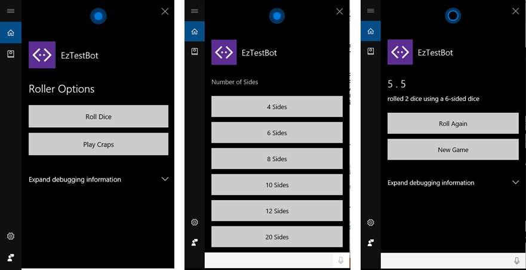

# Roller Skill Bot Sample

A simple dice rolling skill/bot that's been optimized for speech-enabled channels such as Cortana.

[![Deploy to Azure][Deploy Button]][Deploy Node/RollerSkill]

[Deploy Button]: https://azuredeploy.net/deploybutton.png
[Deploy Node/RollerSkill]: https://azuredeploy.net

### Prerequisites

The minimum prerequisites to run this sample are:
* Latest Node.js with NPM. Download it from [here](https://nodejs.org/en/download/).
* The Bot Framework Emulator. To install the Bot Framework Emulator, download it from [here](https://emulator.botframework.com/). Please refer to [this documentation article](https://github.com/microsoft/botframework-emulator/wiki/Getting-Started) to know more about the Bot Framework Emulator.
* **[Recommended]** Visual Studio Code for IntelliSense and debugging, download it from [here](https://code.visualstudio.com/) for free.
* To fully test this sample you must:
    * Register you bot in [Microsoft Bot Framework Portal](https://dev.botframework.com/bots). Please refer to [this](https://docs.microsoft.com/en-us/bot-framework/portal-register-bot) for the instructions. Once you complete the registration, update the [.env](.env) file with the registered config values. 
    * Enable the Cortana Channel and register your bot as a Cortana skill. Refer to [this](https://docs.microsoft.com/en-us/bot-framework/portal-configure-channels) for more information on how to configure channels and to [this](https://docs.microsoft.com/en-us/bot-framework/channels/channel-cortana) and [this](https://docs.microsoft.com/en-us/cortana/tutorials/bot-skills/add-bot-to-cortana-channel) for specific information on how to add the Cortana channel to your bot.
    *  [Publish your bot, for example to Azure](https://docs.microsoft.com/en-us/bot-framework/deploy-bot-overview) or [Debug an Azure Bot Service bot](https://docs.microsoft.com/en-us/bot-framework/azure/azure-bot-service-debug-bot).

### Code Highlights

Many channels provides an audio component besides the usual visual component, allowing your bot to have a voice. This sample showcases the use of new features designed specifically for speech:

* **IMessage.speak**: Lets include Speech Synthesis Markup Language (SSML) in your bots responses to control what the bot says, in addition to what it shows. A small [utility module](ssml.js) is included to simplify building up your bots SSML based responses.
* **IMessage.inputHint**: Used to provide a speech based client with hints as to how they should manage the microphone, expects one of the following values from the [`builder.InputHint`](https://docs.botframework.com/en-us/node/builder/chat-reference/modules/_botbuilder_d_.html#inputhint):

|Name|Description|
|---|---|
|InputHint.acceptingInput|Your bot is passively ready for input but is not waiting on a response (the mic should be closed)|
|InputHint.expectingInput|Your bot is actively expecting a response from the user (the mic should be left open)|
|InputHint.ignoringInput|Your bot is ignoring input. Bots may send this hint if they are actively processing a request and will ignore input from users until the request is complete|

* **Session.say()**: A new method that can be called in place of `Session.send()` and includes additional parameters for sending SSML output, as well as attachments like cards. 
* **IPromptOptions.speak & retrySpeak**: The built-in prompts have all been updated to support sending SSML as part of the prompts output.
* **Prompts.choice() synonyms**: The built-in choice() prompt has been updated to support passing in synonyms which allows for more flexibility recognition wise.
* **Other Prompt Improvements**: A number of other improvements have been made to the built-in prompts to add with building bots that work better with speech recognition.

In general the BotBuilder SDK will send these hints for you automatically, so you don't have to worry too much about them. Checkout the use of the [`speak` method helper](app.js#L267-L271) and `InputHint` properties in the [`HelpDialog`](app.js#L253-L265) dialog.

````JavaScript
bot.dialog('HelpDialog', function (session) {
    var card = new builder.HeroCard(session)
        .title('help_title')
        .buttons([
            builder.CardAction.imBack(session, 'roll some dice', 'Roll Dice'),
            builder.CardAction.imBack(session, 'play craps', 'Play Craps')
        ]);
    var msg = new builder.Message(session)
        .speak(speak(session, 'help_ssml'))
        .addAttachment(card)
        .inputHint(builder.InputHint.acceptingInput);
    session.send(msg).endDialog();
}).triggerAction({ matches: /help/i });

/** Helper function to wrap SSML stored in the prompts file with <speak/> tag. */
function speak(session, prompt) {
    var localized = session.gettext(prompt);
    return ssml.speak(localized);
}
````

Built-in prompts also have speech support and they can send plain text as well as SSML thanks to the `speak` property from the [`IPromptChoiceOptions`](https://docs.botframework.com/en-us/node/builder/chat-reference/interfaces/_botbuilder_d_.ipromptchoiceoptions.html#speak). Checkout the use of the `speak` property in a PromptChoice dialog in the [`CreateGameDialog`](apps.js#L58-L79) dialog.

````JavaScript
/**
    * Ask for the number of sides.
    * 
    * You can pass an array of choices to be matched. These will be shown as a
    * numbered list by default.  This list will be shown as a numbered list which
    * is what we want since we have so many options.
    * 
    * - value is what you want returned via 'results.response.entity' when selected.
    * - action lets you customize the displayed label and for buttons what get sent when clicked.
    * - synonyms let you specify alternate things to recognize for a choice.
    */
var choices = [
    { value: '4', action: { title: '4 Sides' }, synonyms: 'four|for|4 sided|4 sides' },
    { value: '6', action: { title: '6 Sides' }, synonyms: 'six|sex|6 sided|6 sides' },
    { value: '8', action: { title: '8 Sides' }, synonyms: 'eight|8 sided|8 sides' },
    { value: '10', action: { title: '10 Sides' }, synonyms: 'ten|10 sided|10 sides' },
    { value: '12', action: { title: '12 Sides' }, synonyms: 'twelve|12 sided|12 sides' },
    { value: '20', action: { title: '20 Sides' }, synonyms: 'twenty|20 sided|20 sides' }
];
builder.Prompts.choice(session, 'choose_sides', choices, { 
    speak: speak(session, 'choose_sides_ssml') 
});
````

### Outcome
You will see the following when talking to the Bot via Cortana.



### More Information

To get more information about how to get started in Bot Builder for Node please review the following resources:
* [Bot Builder for Node.js Reference](https://docs.microsoft.com/en-us/bot-framework/nodejs/)
* [SSML Language Reference](https://msdn.microsoft.com/en-us/library/hh378377(v=office.14).aspx)
* [Build a speech-enabled bot with Cortana Skills](https://docs.microsoft.com/en-us/bot-framework/nodejs/bot-builder-nodejs-cortana-skill)
* [The Cortana Skills Kit](https://docs.microsoft.com/en-us/cortana/getstarted)
* [Creating a Skill from Scratch using Bot Framework](https://docs.microsoft.com/en-us/cortana/tutorials/bot-skills/add-bot-to-cortana-channel)
元素检查点数据中心使用参数使用                         mouseover录制模拟键盘输入模拟左键单击右键单击录制元素拖拽录制滚动录制                         文件上传录制日期控件录制                         元素精确选择元素参数创建                         鼠标左键单击鼠标mouseover
